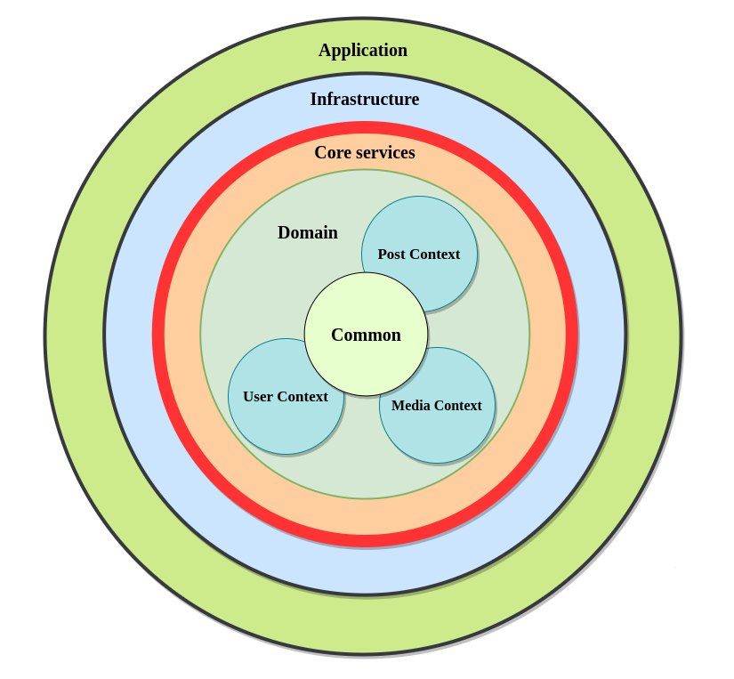
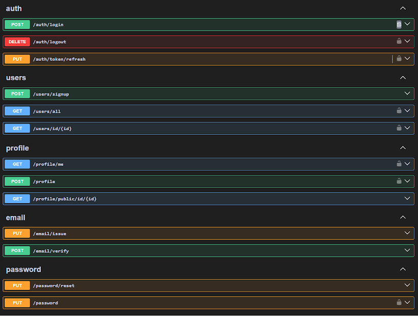
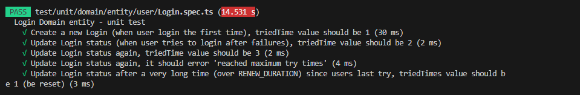
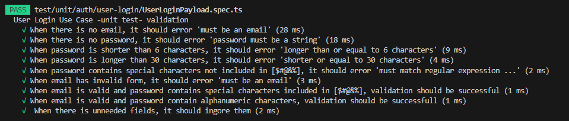
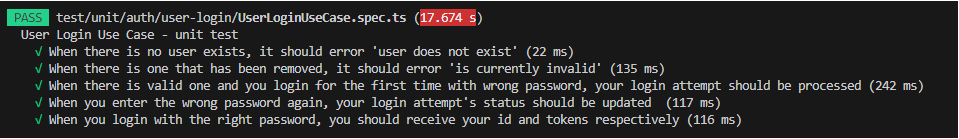
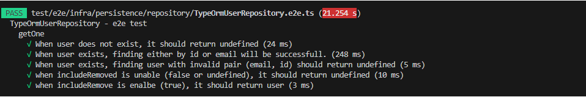
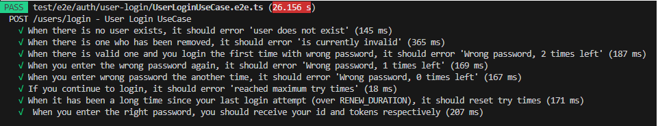

<h2 align="center">Clean Architecture With NestJs</h2>
  
<h3 align="center">A NestJs Backend Application of several use cases implemented Clean Architecture</h3>

##  Table of Contents

- [About this project](#about )
- [The Clean Architecture](#cleanarchitecture)
- [Project workflows](#workflow)
- [Use cases](#usecase )
- [Tests](#test)
- [Thank you](#thank )

##  About this project 

#### Core technologies
1. **NestJs as backend framework**
2. **MySql as database**
3. **TypeOrm as Object Relational Mapper & TypeOrm Transactional**
4. **Jest as testing framework**
5. **Swagger as API Documentation**
6. **JWT**

#### Inspiration
This project is inspired by Mr.Pvarentsov's public repository  [Typescript-Clean-Architecture](https://github.com/pvarentsov/typescript-clean-architecture)
I have learned a lot from his repository. But there is a problem with his codebase, that is he didn't choose to structure his project into modules, which is what NestJs aiming to. Instead divided it into layers corresponding to the Clean Architecture. This way, files that are related to same features are not grouped into one. Make it harder to understand, develop and maintain our app compared to a modulized app. It is not recommended to structure our app by layers though ([How to put it all together](https://herbertograca.com/2017/11/16/explicit-architecture-01-ddd-hexagonal-onion-clean-cqrs-how-i-put-it-all-together/))
> So far we have been segregating the code based on layers, but that is the fine-grained code segregation. The coarse-grained segregation of code is at least as important and it’s about segregating the code according to sub-domains and bounded contexts, following Robert C. Martin ideas expressed in screaming architecture. This is often referred to as “Package by feature” or “Package by component” as opposed to”Package by layer“

## The Clean Architecture 
 
The Clean Architecture divides our app into independent layers by interfaces, that developers can work on simultaneously and making changes will have least effects to the current codebase.

 
    

There are 4 main layers as follows:
* **Application Layer** includes **Controllers** for receiving client requests, handing them to the *Core Service Layer* to process, then take the result and send back to clients.

* **Infrastructure Layer** contains **External Modules** (for example Persistence Module, Email Sender) and everything needed (configs, classes, interfaces) for these modules to communicate and assist *Core Service Layer* in handling client requests,  

* **Core Service Layer** contains specific **Business Use Cases** which will change quite frequently thoughout the app life time

* **Domain Layer** contains table specifications of our databases (**Models/ Domail Entities**). This layer is less changing than *Core Service Layer* 

* **Common Layer** contains **shared code** like helpers, utils,..etc. that will be used by other layers

### Clean Architecture In this project
**Common/ Shared Layer ("core" folder)**\
**Application Layer (Controllers)**\
&nbsp;&nbsp;&nbsp;&nbsp;&nbsp;&nbsp;&nbsp;&nbsp;&nbsp;&nbsp;&nbsp;&nbsp;&nbsp;&nbsp;&nbsp;&nbsp;&nbsp;&nbsp;&nbsp;&nbsp;&nbsp;&nbsp;&nbsp;|\
&nbsp;&nbsp;&nbsp;&nbsp;(communicate via) Use Case interfaces\
&nbsp;&nbsp;&nbsp;&nbsp;&nbsp;&nbsp;&nbsp;&nbsp;&nbsp;&nbsp;&nbsp;&nbsp;&nbsp;&nbsp;&nbsp;&nbsp;&nbsp;&nbsp;&nbsp;&nbsp;&nbsp;&nbsp;&nbsp;|\
**Core Service Layer (Use Case classes)**\
&nbsp;&nbsp;&nbsp;&nbsp;&nbsp;&nbsp;&nbsp;&nbsp;&nbsp;&nbsp;&nbsp;&nbsp;&nbsp;&nbsp;&nbsp;&nbsp;&nbsp;&nbsp;&nbsp;&nbsp;&nbsp;&nbsp;&nbsp;|\
&nbsp;&nbsp;&nbsp;&nbsp;Custom Repository interfaces\
&nbsp;&nbsp;&nbsp;&nbsp;&nbsp;&nbsp;&nbsp;&nbsp;&nbsp;&nbsp;&nbsp;&nbsp;&nbsp;&nbsp;&nbsp;&nbsp;&nbsp;&nbsp;&nbsp;&nbsp;&nbsp;&nbsp;&nbsp;|\
**Infrastructure Layer (TypeOrm Entities, Custom Repositories for Persistence module)**\
&nbsp;&nbsp;&nbsp;&nbsp;&nbsp;&nbsp;&nbsp;&nbsp;&nbsp;&nbsp;&nbsp;&nbsp;&nbsp;&nbsp;&nbsp;&nbsp;&nbsp;&nbsp;&nbsp;&nbsp;&nbsp;&nbsp;&nbsp;|\
&nbsp;&nbsp;&nbsp;&nbsp;TypeOrm Entity Mappers\
&nbsp;&nbsp;&nbsp;&nbsp;&nbsp;&nbsp;&nbsp;&nbsp;&nbsp;&nbsp;&nbsp;&nbsp;&nbsp;&nbsp;&nbsp;&nbsp;&nbsp;&nbsp;&nbsp;&nbsp;&nbsp;&nbsp;&nbsp;|\
**Domain Layer (Domain Entities)**

## Project Workflows 

### Work on this project

I can divide it into parts that we can work on simutaneously.
 
* **Part 1** Design **Routers/Controllers** and implement **API Documentation** (for example Swagger)\
Which files we will work on?\
👉 Controlllers; doc file for each use case (for example UserLoginDoc.ts)

* **Part 2** Design **TypeOrm Entities** (Persistence Entities) and **Domain Entities** \
👉 TypeOrm Entities; Domain Entities (properties, methods for entity creation); TypeOrm Entity Mappers

* **Part 3** Design interfaces, implement and writing tests for **Custom Repositories/ TypeOrm Entity Repositories** (we should not use TypeOrm Query Builder or Entity Manager directly)\
👉 Custom Repository interfaces; Custom Repository classes; Custom Repository testing files

* **Part 4** Implement and writing tests for **Use Case classes** and methods of **Domain Entities**. This part has heaviest workload.\
👉 Payload file (for example UserLoginPayload.ts), Use Case interface, Use Case class, Use Case testing file, fulfill Controller **for each use case**; Domain Entities (needed methods such as status updation) and testing files 

Note that all **Business Logic** resides in **Use Case classes** and **Domain Entities**:

* **Use Case classes** are where we process business use cases. Only these classes have access to Custom Repositories, typically they will get neccessary entities, do some logic on them and along with the help of Domain Entities, to produce final data as responses to clients
 
* **Domain Entities** are entities that our app will mainly work with. They are strictly implemented classes that contain the major part of our Business Logic. It jobs is to update entity status, then return back to the Use Case, so the Use Case can save to the database and continue to fulfill itself  

### To develop a use case 
Here is my workflow to develop a new use case:

**UseCasePayLoad** (UseCaseBody/Query/Param interfaces, UseCasePayload interface, UseCasePayload) 
→ **UseCase interface** 
→ **Domain Entities methods** (status updation) 
→ **UseCase** 
→ **fulfill Controller** 
→ **Testing on Swagger**

## Use cases 

 
    

## Tests 
I used [Jest](https://jestjs.io/) to writing some unit and end-to-end tests for demonstration purpose:

### Unit test
**For Domain Entities**

 
    

**Each each Use Case**
  -  Payload (validation)

  -  Use Case

### End-to-end test

**For Custorm Repositories**

 
    

**For each Use Case**

 
    

 
## Thank you 
Thank you for reading this post. It is all my personal viewpoint as I spent many weeks to learn NestJs and build this project. I hope you can learn something new from this project as well. Wish you all the best!
